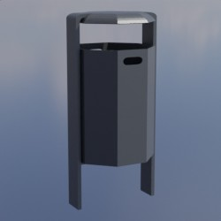
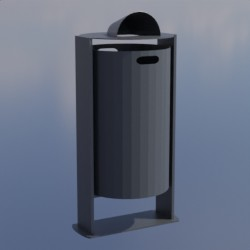
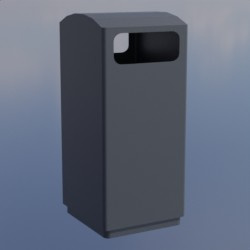
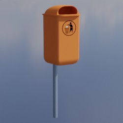
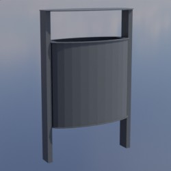
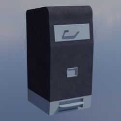
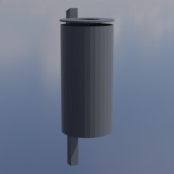

# Abfallbehaelter
Dieses Verzeichnis enthält Modelle von Abfallbehaeltern, welche in der Hansestadt Rostock im öffentlichen Raum aufgestellt sind.

## Grundlage
Als Grundlage für die zur Verfügung gestellten Modelle dienen **Fotos** und **Produktskizzen/-maße** der jeweiligen Realweltobjekte. 
## Modelle 
 | Modellname | Preview | 
 | --- | --- | 
| HuL_Cannes || 
| Eisenjaeger_Primus || 
| Drive_in_240L || 
| Dinova || 
| Wetz_Rostock_60 || 
| Mr_Fill || 
| Punto || 
