# Ampeln
## Allgemein
Dieses Verzeichnis enthält Modelle von Ampeln.

## Grundlage
Als Grundlage für die zur Verfügung gestellten Modelle dienen **Fotos** und **Produktskizzen/-maße** der jeweiligen Realweltobjekte.

## Modelle 
 | Modellname | Preview | 3D-Modell | 
 | --- | --- | --- |
| Ampel_Abbieger_links_Mast |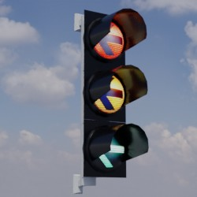| [Link zu Online 3D Viewer](https://3dviewer.net/embed.html#model=https://github.com/rostock/3DModels/blob/main/Ampeln/glb/Ampel_Abbieger_links_Mast.glb$camera=0,0,0$cameramode=perspective$envsettings=fishermans_bastion,on$backgroundcolor=200,200,200,255$defaultcolor=200,200,200$edgesettings=off,0,0,0,20) |
| Ampel_Abbieger_links_geradeaus_Mast |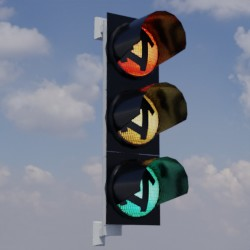| [Link zu Online 3D Viewer](https://3dviewer.net/embed.html#model=https://github.com/rostock/3DModels/blob/main/Ampeln/glb/Ampel_Abbieger_links_geradeaus_Mast.glb$camera=0,0,0$cameramode=perspective$envsettings=fishermans_bastion,on$backgroundcolor=200,200,200,255$defaultcolor=200,200,200$edgesettings=off,0,0,0,20) |
| Ampel_Abbieger_rechts_geradeaus_Mast |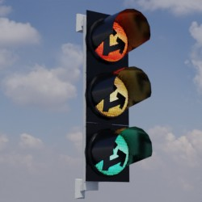| [Link zu Online 3D Viewer](https://3dviewer.net/embed.html#model=https://github.com/rostock/3DModels/blob/main/Ampeln/glb/Ampel_Abbieger_rechts_geradeaus_Mast.glb$camera=0,0,0$cameramode=perspective$envsettings=fishermans_bastion,on$backgroundcolor=200,200,200,255$defaultcolor=200,200,200$edgesettings=off,0,0,0,20) |
| Ampel_Standard_Ausleger |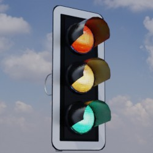| [Link zu Online 3D Viewer](https://3dviewer.net/embed.html#model=https://github.com/rostock/3DModels/blob/main/Ampeln/glb/Ampel_Standard_Ausleger.glb$camera=0,0,0$cameramode=perspective$envsettings=fishermans_bastion,on$backgroundcolor=200,200,200,255$defaultcolor=200,200,200$edgesettings=off,0,0,0,20) |
| Ampel_Standard_Mast |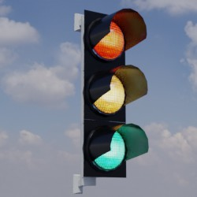| [Link zu Online 3D Viewer](https://3dviewer.net/embed.html#model=https://github.com/rostock/3DModels/blob/main/Ampeln/glb/Ampel_Standard_Mast.glb$camera=0,0,0$cameramode=perspective$envsettings=fishermans_bastion,on$backgroundcolor=200,200,200,255$defaultcolor=200,200,200$edgesettings=off,0,0,0,20) |
| Ampel_Strassenbahn_1_Mast || [Link zu Online 3D Viewer](https://3dviewer.net/embed.html#model=https://github.com/rostock/3DModels/blob/main/Ampeln/glb/Ampel_Strassenbahn_1_Mast.glb$camera=0,0,0$cameramode=perspective$envsettings=fishermans_bastion,on$backgroundcolor=200,200,200,255$defaultcolor=200,200,200$edgesettings=off,0,0,0,20) |
| Fahrradampel_rot_gelb_gruen_Mast |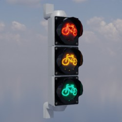| [Link zu Online 3D Viewer](https://3dviewer.net/embed.html#model=https://github.com/rostock/3DModels/blob/main/Ampeln/glb/Fahrradampel_rot_gelb_gruen_Mast.glb$camera=0,0,0$cameramode=perspective$envsettings=fishermans_bastion,on$backgroundcolor=200,200,200,255$defaultcolor=200,200,200$edgesettings=off,0,0,0,20) |
| Fussgaenger_Fahrrad_Ampel_rot_gruen_Mast |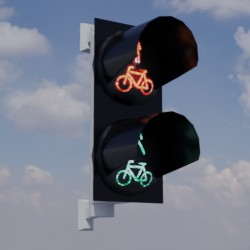| [Link zu Online 3D Viewer](https://3dviewer.net/embed.html#model=https://github.com/rostock/3DModels/blob/main/Ampeln/glb/Fussgaenger_Fahrrad_Ampel_rot_gruen_Mast.glb$camera=0,0,0$cameramode=perspective$envsettings=fishermans_bastion,on$backgroundcolor=200,200,200,255$defaultcolor=200,200,200$edgesettings=off,0,0,0,20) |
| Fussgaengerampel_rot_Mast |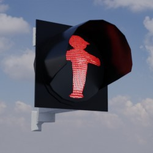| [Link zu Online 3D Viewer](https://3dviewer.net/embed.html#model=https://github.com/rostock/3DModels/blob/main/Ampeln/glb/Fussgaengerampel_rot_Mast.glb$camera=0,0,0$cameramode=perspective$envsettings=fishermans_bastion,on$backgroundcolor=200,200,200,255$defaultcolor=200,200,200$edgesettings=off,0,0,0,20) |
| Fussgaengerampel_rot_gruen_Mast |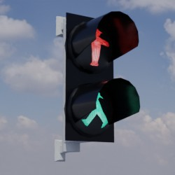| [Link zu Online 3D Viewer](https://3dviewer.net/embed.html#model=https://github.com/rostock/3DModels/blob/main/Ampeln/glb/Fussgaengerampel_rot_gruen_Mast.glb$camera=0,0,0$cameramode=perspective$envsettings=fishermans_bastion,on$backgroundcolor=200,200,200,255$defaultcolor=200,200,200$edgesettings=off,0,0,0,20) |
| Fussgaengerampel_rot_gruen_Signal_Mast |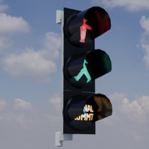| [Link zu Online 3D Viewer](https://3dviewer.net/embed.html#model=https://github.com/rostock/3DModels/blob/main/Ampeln/glb/Fussgaengerampel_rot_gruen_Signal_Mast.glb$camera=0,0,0$cameramode=perspective$envsettings=fishermans_bastion,on$backgroundcolor=200,200,200,255$defaultcolor=200,200,200$edgesettings=off,0,0,0,20) |
| Fussgaengerampel_rot_rot_gruen_Mast |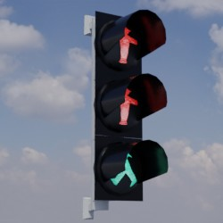| [Link zu Online 3D Viewer](https://3dviewer.net/embed.html#model=https://github.com/rostock/3DModels/blob/main/Ampeln/glb/Fussgaengerampel_rot_rot_gruen_Mast.glb$camera=0,0,0$cameramode=perspective$envsettings=fishermans_bastion,on$backgroundcolor=200,200,200,255$defaultcolor=200,200,200$edgesettings=off,0,0,0,20) |
| Schutzblinker_Fussgaenger_Fahrrad_Mast |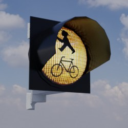| [Link zu Online 3D Viewer](https://3dviewer.net/embed.html#model=https://github.com/rostock/3DModels/blob/main/Ampeln/glb/Schutzblinker_Fussgaenger_Fahrrad_Mast.glb$camera=0,0,0$cameramode=perspective$envsettings=fishermans_bastion,on$backgroundcolor=200,200,200,255$defaultcolor=200,200,200$edgesettings=off,0,0,0,20) |
| Schutzblinker_Fussgaenger_Mast |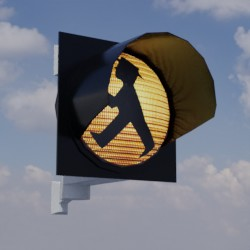| [Link zu Online 3D Viewer](https://3dviewer.net/embed.html#model=https://github.com/rostock/3DModels/blob/main/Ampeln/glb/Schutzblinker_Fussgaenger_Mast.glb$camera=0,0,0$cameramode=perspective$envsettings=fishermans_bastion,on$backgroundcolor=200,200,200,255$defaultcolor=200,200,200$edgesettings=off,0,0,0,20) |
| Schutzblinker_Strassenbahn_Mast |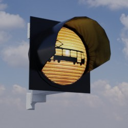| [Link zu Online 3D Viewer](https://3dviewer.net/embed.html#model=https://github.com/rostock/3DModels/blob/main/Ampeln/glb/Schutzblinker_Strassenbahn_Mast.glb$camera=0,0,0$cameramode=perspective$envsettings=fishermans_bastion,on$backgroundcolor=200,200,200,255$defaultcolor=200,200,200$edgesettings=off,0,0,0,20) |
| Stahl_3500 |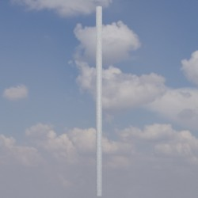| [Link zu Online 3D Viewer](https://3dviewer.net/embed.html#model=https://github.com/rostock/3DModels/blob/main/Ampeln/glb/Stahl_3500.glb$camera=0,0,0$cameramode=perspective$envsettings=fishermans_bastion,on$backgroundcolor=200,200,200,255$defaultcolor=200,200,200$edgesettings=off,0,0,0,20) |
