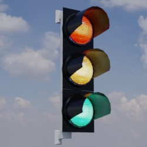
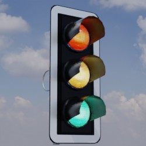

# Ampeln
## Allgemein
Dieses Verzeichnis enthält Modelle von Ampeln.

## Grundlage
Als Grundlage für die zur Verfügung gestellten Modelle dienen **Fotos** und **Produktskizzen/-maße** der jeweiligen Realweltobjekte. 
## Modelle 
 | Modellname | Preview | 3D-Modell | 
 | --- | --- | --- |
| Ampel_Standard_Mast || [Link zu Online 3D Viewer](https://3dviewer.net/embed.html#model=https://github.com/rostock/3DModels/blob/dev/GLBFiles/Ampeln/Ampel_Standard_Mast.glb$camera=0,0,0$cameramode=perspective$envsettings=fishermans_bastion,on$backgroundcolor=200,200,200,255$defaultcolor=200,200,200$edgesettings=off,0,0,0,20)  |
| Ampel_Standard_Ausleger || [Link zu Online 3D Viewer](https://3dviewer.net/embed.html#model=https://github.com/rostock/3DModels/blob/dev/GLBFiles/Ampeln/Ampel_Standard_Ausleger.glb$camera=0,0,0$cameramode=perspective$envsettings=fishermans_bastion,on$backgroundcolor=200,200,200,255$defaultcolor=200,200,200$edgesettings=off,0,0,0,20)  |
