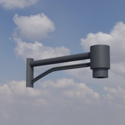
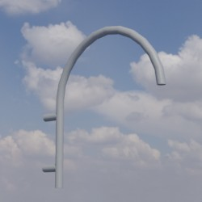
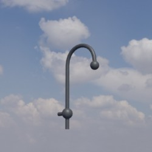
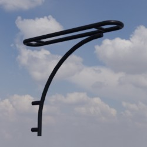
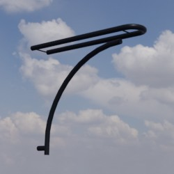
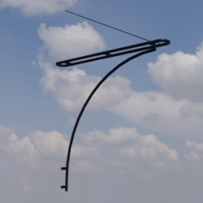
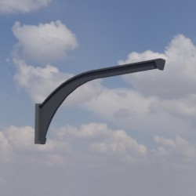
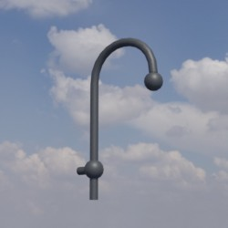
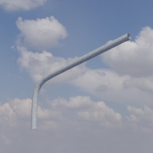

# Ausleger
Dieses Verzeichnis enthält Modelle von Ausleger. Die nachgestellten Parameter beschreiben Offsets der zugehörigen Lampe relativ zur Hauptachse des Mastes in Millimeter.

Zugehörige Lampen und Masten können über den Dateinamen identifiziert werden.

## Grundlage
Als Grundlage für die zur Verfügung gestellten Modelle dienen **Fotos** und **Produktskizzen/-maße** der jeweiligen Realweltobjekte. 
## Modelle 
 | Modellname | Preview | 
 | --- | --- | 
| Basket_x700_y0_ae_h0 || 
| Jana_x700_y0_ae_h0 || 
| Kleine_Glocke_x490_y400_ae_h0 || 
| Urbi_3_x1250_y-1230_ae_h8000 || 
| Semaphor_x1037_y546_ae_h0 || 
| Urbi_3_x2390_y-1051_ad_h11200 || 
| Agora_x0_y706_ae_h0 || 
| Urbi_3_x1250_y-1230_ad_h8000 || 
| Urbi_3_x2390_y-1051_ae_h11200 || 
| Park_Crown_x650_y0_ae_h0 || 
| Grosse_Glocke_x670_y470_ae_h0 || 
| Standard_x1500_y1000_ae_h0 || 
