# Lampen
## Allgemein
Dieses Verzeichnis enthält Modelle von Lampenkörpern. Diese entsprechen dem Bauteil ohne Mast oder Ausleger (sofern vorhanden). 
Es werden drei grundsätzliche Typen von Leuchten umgesetzt:
- Aufsatzleuchte
- Ansatzleuchte
- Hängeleuchte

Zugehörige Masten und Ausleger können über den Dateinamen identifiziert werden.

## Grundlage
Als Grundlage für die zur Verfügung gestellten Modelle dienen **Fotos** und **Produktskizzen/-maße** der jeweiligen Realweltobjekte. 
## Modelle 
 | Modellname | Preview | 3D-Modell | 
 | --- | --- | --- |
| 2020 ||[Link zu Online 3D Viewer](https://3dviewer.net/embed.html#model=https://github.com/rostock/3DModels/blob/dev/GLBFiles/Beleuchtung/Lampen/2020.glb$camera=0,0,0$cameramode=perspective$envsettings=fishermans_bastion,on$backgroundcolor=200,200,200,255$defaultcolor=200,200,200$edgesettings=off,0,0,0,20)  |
| 2310 ||[Link zu Online 3D Viewer](https://3dviewer.net/embed.html#model=https://github.com/rostock/3DModels/blob/dev/GLBFiles/Beleuchtung/Lampen/2310.glb$camera=0,0,0$cameramode=perspective$envsettings=fishermans_bastion,on$backgroundcolor=200,200,200,255$defaultcolor=200,200,200$edgesettings=off,0,0,0,20)  |
| 5450 ||[Link zu Online 3D Viewer](https://3dviewer.net/embed.html#model=https://github.com/rostock/3DModels/blob/dev/GLBFiles/Beleuchtung/Lampen/5450.glb$camera=0,0,0$cameramode=perspective$envsettings=fishermans_bastion,on$backgroundcolor=200,200,200,255$defaultcolor=200,200,200$edgesettings=off,0,0,0,20)  |
| 5460 ||[Link zu Online 3D Viewer](https://3dviewer.net/embed.html#model=https://github.com/rostock/3DModels/blob/dev/GLBFiles/Beleuchtung/Lampen/5460.glb$camera=0,0,0$cameramode=perspective$envsettings=fishermans_bastion,on$backgroundcolor=200,200,200,255$defaultcolor=200,200,200$edgesettings=off,0,0,0,20)  |
| 5480 |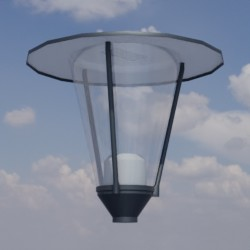|[Link zu Online 3D Viewer](https://3dviewer.net/embed.html#model=https://github.com/rostock/3DModels/blob/dev/GLBFiles/Beleuchtung/Lampen/5480.glb$camera=0,0,0$cameramode=perspective$envsettings=fishermans_bastion,on$backgroundcolor=200,200,200,255$defaultcolor=200,200,200$edgesettings=off,0,0,0,20)  |
| 8071 |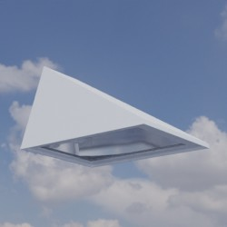|[Link zu Online 3D Viewer](https://3dviewer.net/embed.html#model=https://github.com/rostock/3DModels/blob/dev/GLBFiles/Beleuchtung/Lampen/8071.glb$camera=0,0,0$cameramode=perspective$envsettings=fishermans_bastion,on$backgroundcolor=200,200,200,255$defaultcolor=200,200,200$edgesettings=off,0,0,0,20)  |
| 8413 |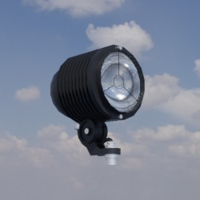|[Link zu Online 3D Viewer](https://3dviewer.net/embed.html#model=https://github.com/rostock/3DModels/blob/dev/GLBFiles/Beleuchtung/Lampen/8413.glb$camera=0,0,0$cameramode=perspective$envsettings=fishermans_bastion,on$backgroundcolor=200,200,200,255$defaultcolor=200,200,200$edgesettings=off,0,0,0,20)  |
| 8904 ||[Link zu Online 3D Viewer](https://3dviewer.net/embed.html#model=https://github.com/rostock/3DModels/blob/dev/GLBFiles/Beleuchtung/Lampen/8904.glb$camera=0,0,0$cameramode=perspective$envsettings=fishermans_bastion,on$backgroundcolor=200,200,200,255$defaultcolor=200,200,200$edgesettings=off,0,0,0,20)  |
| 8949 ||[Link zu Online 3D Viewer](https://3dviewer.net/embed.html#model=https://github.com/rostock/3DModels/blob/dev/GLBFiles/Beleuchtung/Lampen/8949.glb$camera=0,0,0$cameramode=perspective$envsettings=fishermans_bastion,on$backgroundcolor=200,200,200,255$defaultcolor=200,200,200$edgesettings=off,0,0,0,20)  |
| 9081 ||[Link zu Online 3D Viewer](https://3dviewer.net/embed.html#model=https://github.com/rostock/3DModels/blob/dev/GLBFiles/Beleuchtung/Lampen/9081.glb$camera=0,0,0$cameramode=perspective$envsettings=fishermans_bastion,on$backgroundcolor=200,200,200,255$defaultcolor=200,200,200$edgesettings=off,0,0,0,20)  |
| 9351 |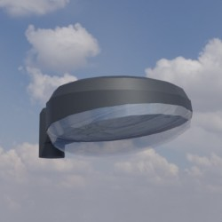|[Link zu Online 3D Viewer](https://3dviewer.net/embed.html#model=https://github.com/rostock/3DModels/blob/dev/GLBFiles/Beleuchtung/Lampen/9351.glb$camera=0,0,0$cameramode=perspective$envsettings=fishermans_bastion,on$backgroundcolor=200,200,200,255$defaultcolor=200,200,200$edgesettings=off,0,0,0,20)  |
| 9821 ||[Link zu Online 3D Viewer](https://3dviewer.net/embed.html#model=https://github.com/rostock/3DModels/blob/dev/GLBFiles/Beleuchtung/Lampen/9821.glb$camera=0,0,0$cameramode=perspective$envsettings=fishermans_bastion,on$backgroundcolor=200,200,200,255$defaultcolor=200,200,200$edgesettings=off,0,0,0,20)  |
| ARC_80 |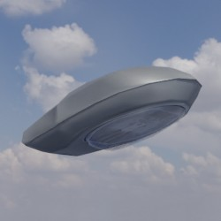|[Link zu Online 3D Viewer](https://3dviewer.net/embed.html#model=https://github.com/rostock/3DModels/blob/dev/GLBFiles/Beleuchtung/Lampen/ARC_80.glb$camera=0,0,0$cameramode=perspective$envsettings=fishermans_bastion,on$backgroundcolor=200,200,200,255$defaultcolor=200,200,200$edgesettings=off,0,0,0,20)  |
| Agora ||[Link zu Online 3D Viewer](https://3dviewer.net/embed.html#model=https://github.com/rostock/3DModels/blob/dev/GLBFiles/Beleuchtung/Lampen/Agora.glb$camera=0,0,0$cameramode=perspective$envsettings=fishermans_bastion,on$backgroundcolor=200,200,200,255$defaultcolor=200,200,200$edgesettings=off,0,0,0,20)  |
| Albstadt ||[Link zu Online 3D Viewer](https://3dviewer.net/embed.html#model=https://github.com/rostock/3DModels/blob/dev/GLBFiles/Beleuchtung/Lampen/Albstadt.glb$camera=0,0,0$cameramode=perspective$envsettings=fishermans_bastion,on$backgroundcolor=200,200,200,255$defaultcolor=200,200,200$edgesettings=off,0,0,0,20)  |
| Alfons_I |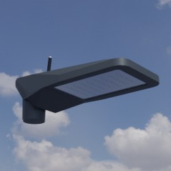|[Link zu Online 3D Viewer](https://3dviewer.net/embed.html#model=https://github.com/rostock/3DModels/blob/dev/GLBFiles/Beleuchtung/Lampen/Alfons_I.glb$camera=0,0,0$cameramode=perspective$envsettings=fishermans_bastion,on$backgroundcolor=200,200,200,255$defaultcolor=200,200,200$edgesettings=off,0,0,0,20)  |
| Alfons_II |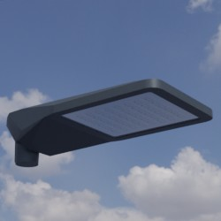|[Link zu Online 3D Viewer](https://3dviewer.net/embed.html#model=https://github.com/rostock/3DModels/blob/dev/GLBFiles/Beleuchtung/Lampen/Alfons_II.glb$camera=0,0,0$cameramode=perspective$envsettings=fishermans_bastion,on$backgroundcolor=200,200,200,255$defaultcolor=200,200,200$edgesettings=off,0,0,0,20)  |
| Alte_Stadt ||[Link zu Online 3D Viewer](https://3dviewer.net/embed.html#model=https://github.com/rostock/3DModels/blob/dev/GLBFiles/Beleuchtung/Lampen/Alte_Stadt.glb$camera=0,0,0$cameramode=perspective$envsettings=fishermans_bastion,on$backgroundcolor=200,200,200,255$defaultcolor=200,200,200$edgesettings=off,0,0,0,20)  |
| BDS470 |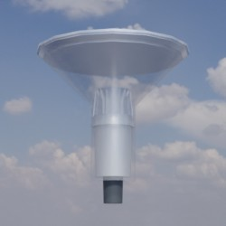|[Link zu Online 3D Viewer](https://3dviewer.net/embed.html#model=https://github.com/rostock/3DModels/blob/dev/GLBFiles/Beleuchtung/Lampen/BDS470.glb$camera=0,0,0$cameramode=perspective$envsettings=fishermans_bastion,on$backgroundcolor=200,200,200,255$defaultcolor=200,200,200$edgesettings=off,0,0,0,20)  |
| BDS471 |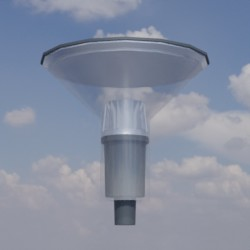|[Link zu Online 3D Viewer](https://3dviewer.net/embed.html#model=https://github.com/rostock/3DModels/blob/dev/GLBFiles/Beleuchtung/Lampen/BDS471.glb$camera=0,0,0$cameramode=perspective$envsettings=fishermans_bastion,on$backgroundcolor=200,200,200,255$defaultcolor=200,200,200$edgesettings=off,0,0,0,20)  |
| Basket |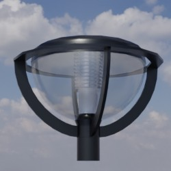|[Link zu Online 3D Viewer](https://3dviewer.net/embed.html#model=https://github.com/rostock/3DModels/blob/dev/GLBFiles/Beleuchtung/Lampen/Basket.glb$camera=0,0,0$cameramode=perspective$envsettings=fishermans_bastion,on$backgroundcolor=200,200,200,255$defaultcolor=200,200,200$edgesettings=off,0,0,0,20)  |
| Campus |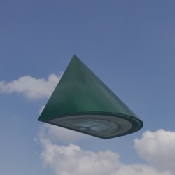|[Link zu Online 3D Viewer](https://3dviewer.net/embed.html#model=https://github.com/rostock/3DModels/blob/dev/GLBFiles/Beleuchtung/Lampen/Campus.glb$camera=0,0,0$cameramode=perspective$envsettings=fishermans_bastion,on$backgroundcolor=200,200,200,255$defaultcolor=200,200,200$edgesettings=off,0,0,0,20)  |
| City-Light-Plus ||[Link zu Online 3D Viewer](https://3dviewer.net/embed.html#model=https://github.com/rostock/3DModels/blob/dev/GLBFiles/Beleuchtung/Lampen/City-Light-Plus.glb$camera=0,0,0$cameramode=perspective$envsettings=fishermans_bastion,on$backgroundcolor=200,200,200,255$defaultcolor=200,200,200$edgesettings=off,0,0,0,20)  |
| City-Light_Plus ||[Link zu Online 3D Viewer](https://3dviewer.net/embed.html#model=https://github.com/rostock/3DModels/blob/dev/GLBFiles/Beleuchtung/Lampen/City-Light_Plus.glb$camera=0,0,0$cameramode=perspective$envsettings=fishermans_bastion,on$backgroundcolor=200,200,200,255$defaultcolor=200,200,200$edgesettings=off,0,0,0,20)  |
| Convia ||[Link zu Online 3D Viewer](https://3dviewer.net/embed.html#model=https://github.com/rostock/3DModels/blob/dev/GLBFiles/Beleuchtung/Lampen/Convia.glb$camera=0,0,0$cameramode=perspective$envsettings=fishermans_bastion,on$backgroundcolor=200,200,200,255$defaultcolor=200,200,200$edgesettings=off,0,0,0,20)  |
| DL20 ||[Link zu Online 3D Viewer](https://3dviewer.net/embed.html#model=https://github.com/rostock/3DModels/blob/dev/GLBFiles/Beleuchtung/Lampen/DL20.glb$camera=0,0,0$cameramode=perspective$envsettings=fishermans_bastion,on$backgroundcolor=200,200,200,255$defaultcolor=200,200,200$edgesettings=off,0,0,0,20)  |
| DL30 ||[Link zu Online 3D Viewer](https://3dviewer.net/embed.html#model=https://github.com/rostock/3DModels/blob/dev/GLBFiles/Beleuchtung/Lampen/DL30.glb$camera=0,0,0$cameramode=perspective$envsettings=fishermans_bastion,on$backgroundcolor=200,200,200,255$defaultcolor=200,200,200$edgesettings=off,0,0,0,20)  |
| DL_20 ||[Link zu Online 3D Viewer](https://3dviewer.net/embed.html#model=https://github.com/rostock/3DModels/blob/dev/GLBFiles/Beleuchtung/Lampen/DL_20.glb$camera=0,0,0$cameramode=perspective$envsettings=fishermans_bastion,on$backgroundcolor=200,200,200,255$defaultcolor=200,200,200$edgesettings=off,0,0,0,20)  |
| DL_302 ||[Link zu Online 3D Viewer](https://3dviewer.net/embed.html#model=https://github.com/rostock/3DModels/blob/dev/GLBFiles/Beleuchtung/Lampen/DL_302.glb$camera=0,0,0$cameramode=perspective$envsettings=fishermans_bastion,on$backgroundcolor=200,200,200,255$defaultcolor=200,200,200$edgesettings=off,0,0,0,20)  |
| DL_304 |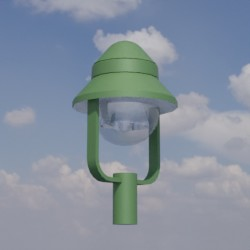|[Link zu Online 3D Viewer](https://3dviewer.net/embed.html#model=https://github.com/rostock/3DModels/blob/dev/GLBFiles/Beleuchtung/Lampen/DL_304.glb$camera=0,0,0$cameramode=perspective$envsettings=fishermans_bastion,on$backgroundcolor=200,200,200,255$defaultcolor=200,200,200$edgesettings=off,0,0,0,20)  |
| DL_400 |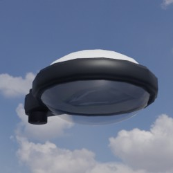|[Link zu Online 3D Viewer](https://3dviewer.net/embed.html#model=https://github.com/rostock/3DModels/blob/dev/GLBFiles/Beleuchtung/Lampen/DL_400.glb$camera=0,0,0$cameramode=perspective$envsettings=fishermans_bastion,on$backgroundcolor=200,200,200,255$defaultcolor=200,200,200$edgesettings=off,0,0,0,20)  |
| DL_50_Midi ||[Link zu Online 3D Viewer](https://3dviewer.net/embed.html#model=https://github.com/rostock/3DModels/blob/dev/GLBFiles/Beleuchtung/Lampen/DL_50_Midi.glb$camera=0,0,0$cameramode=perspective$envsettings=fishermans_bastion,on$backgroundcolor=200,200,200,255$defaultcolor=200,200,200$edgesettings=off,0,0,0,20)  |
| DL_50_Mini ||[Link zu Online 3D Viewer](https://3dviewer.net/embed.html#model=https://github.com/rostock/3DModels/blob/dev/GLBFiles/Beleuchtung/Lampen/DL_50_Mini.glb$camera=0,0,0$cameramode=perspective$envsettings=fishermans_bastion,on$backgroundcolor=200,200,200,255$defaultcolor=200,200,200$edgesettings=off,0,0,0,20)  |
| Dieter_I |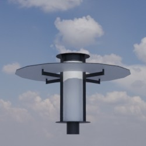|[Link zu Online 3D Viewer](https://3dviewer.net/embed.html#model=https://github.com/rostock/3DModels/blob/dev/GLBFiles/Beleuchtung/Lampen/Dieter_I.glb$camera=0,0,0$cameramode=perspective$envsettings=fishermans_bastion,on$backgroundcolor=200,200,200,255$defaultcolor=200,200,200$edgesettings=off,0,0,0,20)  |
| Discera_600 ||[Link zu Online 3D Viewer](https://3dviewer.net/embed.html#model=https://github.com/rostock/3DModels/blob/dev/GLBFiles/Beleuchtung/Lampen/Discera_600.glb$camera=0,0,0$cameramode=perspective$envsettings=fishermans_bastion,on$backgroundcolor=200,200,200,255$defaultcolor=200,200,200$edgesettings=off,0,0,0,20)  |
| EVA_I |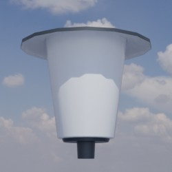|[Link zu Online 3D Viewer](https://3dviewer.net/embed.html#model=https://github.com/rostock/3DModels/blob/dev/GLBFiles/Beleuchtung/Lampen/EVA_I.glb$camera=0,0,0$cameramode=perspective$envsettings=fishermans_bastion,on$backgroundcolor=200,200,200,255$defaultcolor=200,200,200$edgesettings=off,0,0,0,20)  |
| Fiete_I |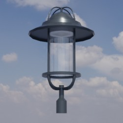|[Link zu Online 3D Viewer](https://3dviewer.net/embed.html#model=https://github.com/rostock/3DModels/blob/dev/GLBFiles/Beleuchtung/Lampen/Fiete_I.glb$camera=0,0,0$cameramode=perspective$envsettings=fishermans_bastion,on$backgroundcolor=200,200,200,255$defaultcolor=200,200,200$edgesettings=off,0,0,0,20)  |
| Floodlight_FL_20 ||[Link zu Online 3D Viewer](https://3dviewer.net/embed.html#model=https://github.com/rostock/3DModels/blob/dev/GLBFiles/Beleuchtung/Lampen/Floodlight_FL_20.glb$camera=0,0,0$cameramode=perspective$envsettings=fishermans_bastion,on$backgroundcolor=200,200,200,255$defaultcolor=200,200,200$edgesettings=off,0,0,0,20)  |
| Freiburg ||[Link zu Online 3D Viewer](https://3dviewer.net/embed.html#model=https://github.com/rostock/3DModels/blob/dev/GLBFiles/Beleuchtung/Lampen/Freiburg.glb$camera=0,0,0$cameramode=perspective$envsettings=fishermans_bastion,on$backgroundcolor=200,200,200,255$defaultcolor=200,200,200$edgesettings=off,0,0,0,20)  |
| Gamma |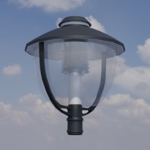|[Link zu Online 3D Viewer](https://3dviewer.net/embed.html#model=https://github.com/rostock/3DModels/blob/dev/GLBFiles/Beleuchtung/Lampen/Gamma.glb$camera=0,0,0$cameramode=perspective$envsettings=fishermans_bastion,on$backgroundcolor=200,200,200,255$defaultcolor=200,200,200$edgesettings=off,0,0,0,20)  |
| Generisch ||[Link zu Online 3D Viewer](https://3dviewer.net/embed.html#model=https://github.com/rostock/3DModels/blob/dev/GLBFiles/Beleuchtung/Lampen/Generisch.glb$camera=0,0,0$cameramode=perspective$envsettings=fishermans_bastion,on$backgroundcolor=200,200,200,255$defaultcolor=200,200,200$edgesettings=off,0,0,0,20)  |
| Globus ||[Link zu Online 3D Viewer](https://3dviewer.net/embed.html#model=https://github.com/rostock/3DModels/blob/dev/GLBFiles/Beleuchtung/Lampen/Globus.glb$camera=0,0,0$cameramode=perspective$envsettings=fishermans_bastion,on$backgroundcolor=200,200,200,255$defaultcolor=200,200,200$edgesettings=off,0,0,0,20)  |
| Grosse_Glocke ||[Link zu Online 3D Viewer](https://3dviewer.net/embed.html#model=https://github.com/rostock/3DModels/blob/dev/GLBFiles/Beleuchtung/Lampen/Grosse_Glocke.glb$camera=0,0,0$cameramode=perspective$envsettings=fishermans_bastion,on$backgroundcolor=200,200,200,255$defaultcolor=200,200,200$edgesettings=off,0,0,0,20)  |
| Grosser_Klassiker |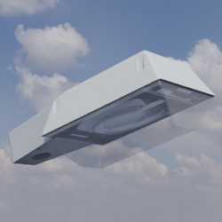|[Link zu Online 3D Viewer](https://3dviewer.net/embed.html#model=https://github.com/rostock/3DModels/blob/dev/GLBFiles/Beleuchtung/Lampen/Grosser_Klassiker.glb$camera=0,0,0$cameramode=perspective$envsettings=fishermans_bastion,on$backgroundcolor=200,200,200,255$defaultcolor=200,200,200$edgesettings=off,0,0,0,20)  |
| Histo |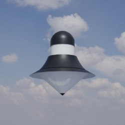|[Link zu Online 3D Viewer](https://3dviewer.net/embed.html#model=https://github.com/rostock/3DModels/blob/dev/GLBFiles/Beleuchtung/Lampen/Histo.glb$camera=0,0,0$cameramode=perspective$envsettings=fishermans_bastion,on$backgroundcolor=200,200,200,255$defaultcolor=200,200,200$edgesettings=off,0,0,0,20)  |
| Jana ||[Link zu Online 3D Viewer](https://3dviewer.net/embed.html#model=https://github.com/rostock/3DModels/blob/dev/GLBFiles/Beleuchtung/Lampen/Jana.glb$camera=0,0,0$cameramode=perspective$envsettings=fishermans_bastion,on$backgroundcolor=200,200,200,255$defaultcolor=200,200,200$edgesettings=off,0,0,0,20)  |
| Kelch |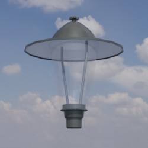|[Link zu Online 3D Viewer](https://3dviewer.net/embed.html#model=https://github.com/rostock/3DModels/blob/dev/GLBFiles/Beleuchtung/Lampen/Kelch.glb$camera=0,0,0$cameramode=perspective$envsettings=fishermans_bastion,on$backgroundcolor=200,200,200,255$defaultcolor=200,200,200$edgesettings=off,0,0,0,20)  |
| Kleine_Glocke |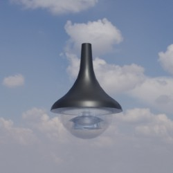|[Link zu Online 3D Viewer](https://3dviewer.net/embed.html#model=https://github.com/rostock/3DModels/blob/dev/GLBFiles/Beleuchtung/Lampen/Kleine_Glocke.glb$camera=0,0,0$cameramode=perspective$envsettings=fishermans_bastion,on$backgroundcolor=200,200,200,255$defaultcolor=200,200,200$edgesettings=off,0,0,0,20)  |
| Kleine_Runde |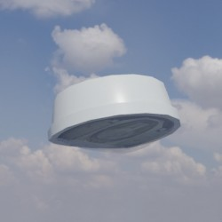|[Link zu Online 3D Viewer](https://3dviewer.net/embed.html#model=https://github.com/rostock/3DModels/blob/dev/GLBFiles/Beleuchtung/Lampen/Kleine_Runde.glb$camera=0,0,0$cameramode=perspective$envsettings=fishermans_bastion,on$backgroundcolor=200,200,200,255$defaultcolor=200,200,200$edgesettings=off,0,0,0,20)  |
| Koffer_150 ||[Link zu Online 3D Viewer](https://3dviewer.net/embed.html#model=https://github.com/rostock/3DModels/blob/dev/GLBFiles/Beleuchtung/Lampen/Koffer_150.glb$camera=0,0,0$cameramode=perspective$envsettings=fishermans_bastion,on$backgroundcolor=200,200,200,255$defaultcolor=200,200,200$edgesettings=off,0,0,0,20)  |
| LIQ_70 |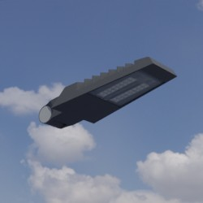|[Link zu Online 3D Viewer](https://3dviewer.net/embed.html#model=https://github.com/rostock/3DModels/blob/dev/GLBFiles/Beleuchtung/Lampen/LIQ_70.glb$camera=0,0,0$cameramode=perspective$envsettings=fishermans_bastion,on$backgroundcolor=200,200,200,255$defaultcolor=200,200,200$edgesettings=off,0,0,0,20)  |
| Laterne |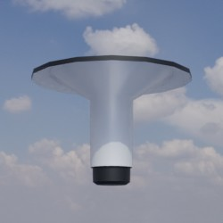|[Link zu Online 3D Viewer](https://3dviewer.net/embed.html#model=https://github.com/rostock/3DModels/blob/dev/GLBFiles/Beleuchtung/Lampen/Laterne.glb$camera=0,0,0$cameramode=perspective$envsettings=fishermans_bastion,on$backgroundcolor=200,200,200,255$defaultcolor=200,200,200$edgesettings=off,0,0,0,20)  |
| Lucas_VII ||[Link zu Online 3D Viewer](https://3dviewer.net/embed.html#model=https://github.com/rostock/3DModels/blob/dev/GLBFiles/Beleuchtung/Lampen/Lucas_VII.glb$camera=0,0,0$cameramode=perspective$envsettings=fishermans_bastion,on$backgroundcolor=200,200,200,255$defaultcolor=200,200,200$edgesettings=off,0,0,0,20)  |
| Lumega_IQ70 ||[Link zu Online 3D Viewer](https://3dviewer.net/embed.html#model=https://github.com/rostock/3DModels/blob/dev/GLBFiles/Beleuchtung/Lampen/Lumega_IQ70.glb$camera=0,0,0$cameramode=perspective$envsettings=fishermans_bastion,on$backgroundcolor=200,200,200,255$defaultcolor=200,200,200$edgesettings=off,0,0,0,20)  |
| Lumega_IQ_70 ||[Link zu Online 3D Viewer](https://3dviewer.net/embed.html#model=https://github.com/rostock/3DModels/blob/dev/GLBFiles/Beleuchtung/Lampen/Lumega_IQ_70.glb$camera=0,0,0$cameramode=perspective$envsettings=fishermans_bastion,on$backgroundcolor=200,200,200,255$defaultcolor=200,200,200$edgesettings=off,0,0,0,20)  |
| Moritz_F_VIII ||[Link zu Online 3D Viewer](https://3dviewer.net/embed.html#model=https://github.com/rostock/3DModels/blob/dev/GLBFiles/Beleuchtung/Lampen/Moritz_F_VIII.glb$camera=0,0,0$cameramode=perspective$envsettings=fishermans_bastion,on$backgroundcolor=200,200,200,255$defaultcolor=200,200,200$edgesettings=off,0,0,0,20)  |
| Moritz_I ||[Link zu Online 3D Viewer](https://3dviewer.net/embed.html#model=https://github.com/rostock/3DModels/blob/dev/GLBFiles/Beleuchtung/Lampen/Moritz_I.glb$camera=0,0,0$cameramode=perspective$envsettings=fishermans_bastion,on$backgroundcolor=200,200,200,255$defaultcolor=200,200,200$edgesettings=off,0,0,0,20)  |
| Moritz_II ||[Link zu Online 3D Viewer](https://3dviewer.net/embed.html#model=https://github.com/rostock/3DModels/blob/dev/GLBFiles/Beleuchtung/Lampen/Moritz_II.glb$camera=0,0,0$cameramode=perspective$envsettings=fishermans_bastion,on$backgroundcolor=200,200,200,255$defaultcolor=200,200,200$edgesettings=off,0,0,0,20)  |
| Nyhavn_Park |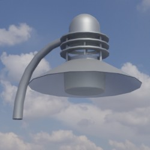|[Link zu Online 3D Viewer](https://3dviewer.net/embed.html#model=https://github.com/rostock/3DModels/blob/dev/GLBFiles/Beleuchtung/Lampen/Nyhavn_Park.glb$camera=0,0,0$cameramode=perspective$envsettings=fishermans_bastion,on$backgroundcolor=200,200,200,255$defaultcolor=200,200,200$edgesettings=off,0,0,0,20)  |
| Otto_XXV |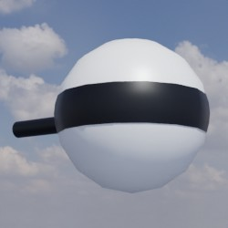|[Link zu Online 3D Viewer](https://3dviewer.net/embed.html#model=https://github.com/rostock/3DModels/blob/dev/GLBFiles/Beleuchtung/Lampen/Otto_XXV.glb$camera=0,0,0$cameramode=perspective$envsettings=fishermans_bastion,on$backgroundcolor=200,200,200,255$defaultcolor=200,200,200$edgesettings=off,0,0,0,20)  |
| Park_Crown ||[Link zu Online 3D Viewer](https://3dviewer.net/embed.html#model=https://github.com/rostock/3DModels/blob/dev/GLBFiles/Beleuchtung/Lampen/Park_Crown.glb$camera=0,0,0$cameramode=perspective$envsettings=fishermans_bastion,on$backgroundcolor=200,200,200,255$defaultcolor=200,200,200$edgesettings=off,0,0,0,20)  |
| Pilz ||[Link zu Online 3D Viewer](https://3dviewer.net/embed.html#model=https://github.com/rostock/3DModels/blob/dev/GLBFiles/Beleuchtung/Lampen/Pilz.glb$camera=0,0,0$cameramode=perspective$envsettings=fishermans_bastion,on$backgroundcolor=200,200,200,255$defaultcolor=200,200,200$edgesettings=off,0,0,0,20)  |
| RSL ||[Link zu Online 3D Viewer](https://3dviewer.net/embed.html#model=https://github.com/rostock/3DModels/blob/dev/GLBFiles/Beleuchtung/Lampen/RSL.glb$camera=0,0,0$cameramode=perspective$envsettings=fishermans_bastion,on$backgroundcolor=200,200,200,255$defaultcolor=200,200,200$edgesettings=off,0,0,0,20)  |
| Richard_IV |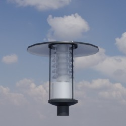|[Link zu Online 3D Viewer](https://3dviewer.net/embed.html#model=https://github.com/rostock/3DModels/blob/dev/GLBFiles/Beleuchtung/Lampen/Richard_IV.glb$camera=0,0,0$cameramode=perspective$envsettings=fishermans_bastion,on$backgroundcolor=200,200,200,255$defaultcolor=200,200,200$edgesettings=off,0,0,0,20)  |
| Richard_VIII |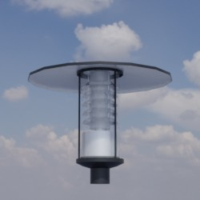|[Link zu Online 3D Viewer](https://3dviewer.net/embed.html#model=https://github.com/rostock/3DModels/blob/dev/GLBFiles/Beleuchtung/Lampen/Richard_VIII.glb$camera=0,0,0$cameramode=perspective$envsettings=fishermans_bastion,on$backgroundcolor=200,200,200,255$defaultcolor=200,200,200$edgesettings=off,0,0,0,20)  |
| SGS_203 |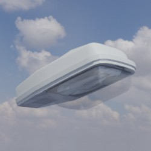|[Link zu Online 3D Viewer](https://3dviewer.net/embed.html#model=https://github.com/rostock/3DModels/blob/dev/GLBFiles/Beleuchtung/Lampen/SGS_203.glb$camera=0,0,0$cameramode=perspective$envsettings=fishermans_bastion,on$backgroundcolor=200,200,200,255$defaultcolor=200,200,200$edgesettings=off,0,0,0,20)  |
| SL_100 ||[Link zu Online 3D Viewer](https://3dviewer.net/embed.html#model=https://github.com/rostock/3DModels/blob/dev/GLBFiles/Beleuchtung/Lampen/SL_100.glb$camera=0,0,0$cameramode=perspective$envsettings=fishermans_bastion,on$backgroundcolor=200,200,200,255$defaultcolor=200,200,200$edgesettings=off,0,0,0,20)  |
| SL_11_Micro ||[Link zu Online 3D Viewer](https://3dviewer.net/embed.html#model=https://github.com/rostock/3DModels/blob/dev/GLBFiles/Beleuchtung/Lampen/SL_11_Micro.glb$camera=0,0,0$cameramode=perspective$envsettings=fishermans_bastion,on$backgroundcolor=200,200,200,255$defaultcolor=200,200,200$edgesettings=off,0,0,0,20)  |
| SL_11_Mini ||[Link zu Online 3D Viewer](https://3dviewer.net/embed.html#model=https://github.com/rostock/3DModels/blob/dev/GLBFiles/Beleuchtung/Lampen/SL_11_Mini.glb$camera=0,0,0$cameramode=perspective$envsettings=fishermans_bastion,on$backgroundcolor=200,200,200,255$defaultcolor=200,200,200$edgesettings=off,0,0,0,20)  |
| SQ_100 |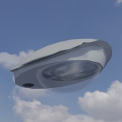|[Link zu Online 3D Viewer](https://3dviewer.net/embed.html#model=https://github.com/rostock/3DModels/blob/dev/GLBFiles/Beleuchtung/Lampen/SQ_100.glb$camera=0,0,0$cameramode=perspective$envsettings=fishermans_bastion,on$backgroundcolor=200,200,200,255$defaultcolor=200,200,200$edgesettings=off,0,0,0,20)  |
| SR_100 ||[Link zu Online 3D Viewer](https://3dviewer.net/embed.html#model=https://github.com/rostock/3DModels/blob/dev/GLBFiles/Beleuchtung/Lampen/SR_100.glb$camera=0,0,0$cameramode=perspective$envsettings=fishermans_bastion,on$backgroundcolor=200,200,200,255$defaultcolor=200,200,200$edgesettings=off,0,0,0,20)  |
| SR_50 |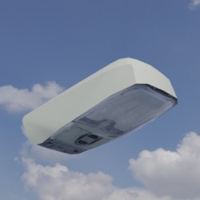|[Link zu Online 3D Viewer](https://3dviewer.net/embed.html#model=https://github.com/rostock/3DModels/blob/dev/GLBFiles/Beleuchtung/Lampen/SR_50.glb$camera=0,0,0$cameramode=perspective$envsettings=fishermans_bastion,on$backgroundcolor=200,200,200,255$defaultcolor=200,200,200$edgesettings=off,0,0,0,20)  |
| Semaphor ||[Link zu Online 3D Viewer](https://3dviewer.net/embed.html#model=https://github.com/rostock/3DModels/blob/dev/GLBFiles/Beleuchtung/Lampen/Semaphor.glb$camera=0,0,0$cameramode=perspective$envsettings=fishermans_bastion,on$backgroundcolor=200,200,200,255$defaultcolor=200,200,200$edgesettings=off,0,0,0,20)  |
| Sonderanfertigung |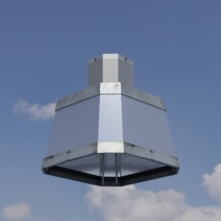|[Link zu Online 3D Viewer](https://3dviewer.net/embed.html#model=https://github.com/rostock/3DModels/blob/dev/GLBFiles/Beleuchtung/Lampen/Sonderanfertigung.glb$camera=0,0,0$cameramode=perspective$envsettings=fishermans_bastion,on$backgroundcolor=200,200,200,255$defaultcolor=200,200,200$edgesettings=off,0,0,0,20)  |
| Sonderringleuchte_1400_mm |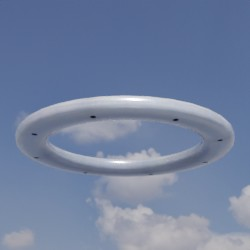|[Link zu Online 3D Viewer](https://3dviewer.net/embed.html#model=https://github.com/rostock/3DModels/blob/dev/GLBFiles/Beleuchtung/Lampen/Sonderringleuchte_1400_mm.glb$camera=0,0,0$cameramode=perspective$envsettings=fishermans_bastion,on$backgroundcolor=200,200,200,255$defaultcolor=200,200,200$edgesettings=off,0,0,0,20)  |
| Stradasole_400 ||[Link zu Online 3D Viewer](https://3dviewer.net/embed.html#model=https://github.com/rostock/3DModels/blob/dev/GLBFiles/Beleuchtung/Lampen/Stradasole_400.glb$camera=0,0,0$cameramode=perspective$envsettings=fishermans_bastion,on$backgroundcolor=200,200,200,255$defaultcolor=200,200,200$edgesettings=off,0,0,0,20)  |
| Stradasole_530 ||[Link zu Online 3D Viewer](https://3dviewer.net/embed.html#model=https://github.com/rostock/3DModels/blob/dev/GLBFiles/Beleuchtung/Lampen/Stradasole_530.glb$camera=0,0,0$cameramode=perspective$envsettings=fishermans_bastion,on$backgroundcolor=200,200,200,255$defaultcolor=200,200,200$edgesettings=off,0,0,0,20)  |
| Strahler_490 |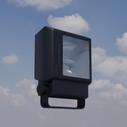|[Link zu Online 3D Viewer](https://3dviewer.net/embed.html#model=https://github.com/rostock/3DModels/blob/dev/GLBFiles/Beleuchtung/Lampen/Strahler_490.glb$camera=0,0,0$cameramode=perspective$envsettings=fishermans_bastion,on$backgroundcolor=200,200,200,255$defaultcolor=200,200,200$edgesettings=off,0,0,0,20)  |
| Strassenleuchte ||[Link zu Online 3D Viewer](https://3dviewer.net/embed.html#model=https://github.com/rostock/3DModels/blob/dev/GLBFiles/Beleuchtung/Lampen/Strassenleuchte.glb$camera=0,0,0$cameramode=perspective$envsettings=fishermans_bastion,on$backgroundcolor=200,200,200,255$defaultcolor=200,200,200$edgesettings=off,0,0,0,20)  |
| Streetlight11_Micro ||[Link zu Online 3D Viewer](https://3dviewer.net/embed.html#model=https://github.com/rostock/3DModels/blob/dev/GLBFiles/Beleuchtung/Lampen/Streetlight11_Micro.glb$camera=0,0,0$cameramode=perspective$envsettings=fishermans_bastion,on$backgroundcolor=200,200,200,255$defaultcolor=200,200,200$edgesettings=off,0,0,0,20)  |
| Streetlight_10_Micro |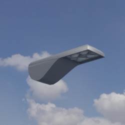|[Link zu Online 3D Viewer](https://3dviewer.net/embed.html#model=https://github.com/rostock/3DModels/blob/dev/GLBFiles/Beleuchtung/Lampen/Streetlight_10_Micro.glb$camera=0,0,0$cameramode=perspective$envsettings=fishermans_bastion,on$backgroundcolor=200,200,200,255$defaultcolor=200,200,200$edgesettings=off,0,0,0,20)  |
| Streetlight_10_Mini |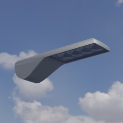|[Link zu Online 3D Viewer](https://3dviewer.net/embed.html#model=https://github.com/rostock/3DModels/blob/dev/GLBFiles/Beleuchtung/Lampen/Streetlight_10_Mini.glb$camera=0,0,0$cameramode=perspective$envsettings=fishermans_bastion,on$backgroundcolor=200,200,200,255$defaultcolor=200,200,200$edgesettings=off,0,0,0,20)  |
| Streetlight_11_Micro ||[Link zu Online 3D Viewer](https://3dviewer.net/embed.html#model=https://github.com/rostock/3DModels/blob/dev/GLBFiles/Beleuchtung/Lampen/Streetlight_11_Micro.glb$camera=0,0,0$cameramode=perspective$envsettings=fishermans_bastion,on$backgroundcolor=200,200,200,255$defaultcolor=200,200,200$edgesettings=off,0,0,0,20)  |
| Streetlight_11_Midi |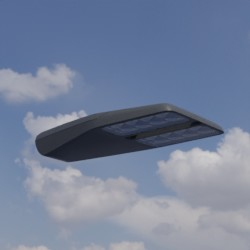|[Link zu Online 3D Viewer](https://3dviewer.net/embed.html#model=https://github.com/rostock/3DModels/blob/dev/GLBFiles/Beleuchtung/Lampen/Streetlight_11_Midi.glb$camera=0,0,0$cameramode=perspective$envsettings=fishermans_bastion,on$backgroundcolor=200,200,200,255$defaultcolor=200,200,200$edgesettings=off,0,0,0,20)  |
| Streetlight_11_Mini ||[Link zu Online 3D Viewer](https://3dviewer.net/embed.html#model=https://github.com/rostock/3DModels/blob/dev/GLBFiles/Beleuchtung/Lampen/Streetlight_11_Mini.glb$camera=0,0,0$cameramode=perspective$envsettings=fishermans_bastion,on$backgroundcolor=200,200,200,255$defaultcolor=200,200,200$edgesettings=off,0,0,0,20)  |
| Streetlight_SL11_Micro |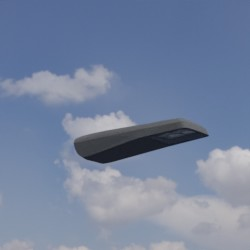|[Link zu Online 3D Viewer](https://3dviewer.net/embed.html#model=https://github.com/rostock/3DModels/blob/dev/GLBFiles/Beleuchtung/Lampen/Streetlight_SL11_Micro.glb$camera=0,0,0$cameramode=perspective$envsettings=fishermans_bastion,on$backgroundcolor=200,200,200,255$defaultcolor=200,200,200$edgesettings=off,0,0,0,20)  |
| Streetlight_SL11_Midi ||[Link zu Online 3D Viewer](https://3dviewer.net/embed.html#model=https://github.com/rostock/3DModels/blob/dev/GLBFiles/Beleuchtung/Lampen/Streetlight_SL11_Midi.glb$camera=0,0,0$cameramode=perspective$envsettings=fishermans_bastion,on$backgroundcolor=200,200,200,255$defaultcolor=200,200,200$edgesettings=off,0,0,0,20)  |
| Streetlight_SL11_Mini ||[Link zu Online 3D Viewer](https://3dviewer.net/embed.html#model=https://github.com/rostock/3DModels/blob/dev/GLBFiles/Beleuchtung/Lampen/Streetlight_SL11_Mini.glb$camera=0,0,0$cameramode=perspective$envsettings=fishermans_bastion,on$backgroundcolor=200,200,200,255$defaultcolor=200,200,200$edgesettings=off,0,0,0,20)  |
| Streetlight_SL_11_Micro ||[Link zu Online 3D Viewer](https://3dviewer.net/embed.html#model=https://github.com/rostock/3DModels/blob/dev/GLBFiles/Beleuchtung/Lampen/Streetlight_SL_11_Micro.glb$camera=0,0,0$cameramode=perspective$envsettings=fishermans_bastion,on$backgroundcolor=200,200,200,255$defaultcolor=200,200,200$edgesettings=off,0,0,0,20)  |
| Streetlight_SL_11_Midi ||[Link zu Online 3D Viewer](https://3dviewer.net/embed.html#model=https://github.com/rostock/3DModels/blob/dev/GLBFiles/Beleuchtung/Lampen/Streetlight_SL_11_Midi.glb$camera=0,0,0$cameramode=perspective$envsettings=fishermans_bastion,on$backgroundcolor=200,200,200,255$defaultcolor=200,200,200$edgesettings=off,0,0,0,20)  |
| Streetlight_SL_11_Mini ||[Link zu Online 3D Viewer](https://3dviewer.net/embed.html#model=https://github.com/rostock/3DModels/blob/dev/GLBFiles/Beleuchtung/Lampen/Streetlight_SL_11_Mini.glb$camera=0,0,0$cameramode=perspective$envsettings=fishermans_bastion,on$backgroundcolor=200,200,200,255$defaultcolor=200,200,200$edgesettings=off,0,0,0,20)  |
| Urbi_3 ||[Link zu Online 3D Viewer](https://3dviewer.net/embed.html#model=https://github.com/rostock/3DModels/blob/dev/GLBFiles/Beleuchtung/Lampen/Urbi_3.glb$camera=0,0,0$cameramode=perspective$envsettings=fishermans_bastion,on$backgroundcolor=200,200,200,255$defaultcolor=200,200,200$edgesettings=off,0,0,0,20)  |
| Urbi_3_Basket ||[Link zu Online 3D Viewer](https://3dviewer.net/embed.html#model=https://github.com/rostock/3DModels/blob/dev/GLBFiles/Beleuchtung/Lampen/Urbi_3_Basket.glb$camera=0,0,0$cameramode=perspective$envsettings=fishermans_bastion,on$backgroundcolor=200,200,200,255$defaultcolor=200,200,200$edgesettings=off,0,0,0,20)  |
| VEB-Alt ||[Link zu Online 3D Viewer](https://3dviewer.net/embed.html#model=https://github.com/rostock/3DModels/blob/dev/GLBFiles/Beleuchtung/Lampen/VEB-Alt.glb$camera=0,0,0$cameramode=perspective$envsettings=fishermans_bastion,on$backgroundcolor=200,200,200,255$defaultcolor=200,200,200$edgesettings=off,0,0,0,20)  |
| Viatana ||[Link zu Online 3D Viewer](https://3dviewer.net/embed.html#model=https://github.com/rostock/3DModels/blob/dev/GLBFiles/Beleuchtung/Lampen/Viatana.glb$camera=0,0,0$cameramode=perspective$envsettings=fishermans_bastion,on$backgroundcolor=200,200,200,255$defaultcolor=200,200,200$edgesettings=off,0,0,0,20)  |
| Vista ||[Link zu Online 3D Viewer](https://3dviewer.net/embed.html#model=https://github.com/rostock/3DModels/blob/dev/GLBFiles/Beleuchtung/Lampen/Vista.glb$camera=0,0,0$cameramode=perspective$envsettings=fishermans_bastion,on$backgroundcolor=200,200,200,255$defaultcolor=200,200,200$edgesettings=off,0,0,0,20)  |
