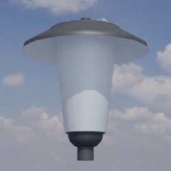
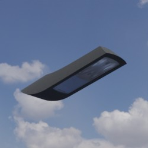
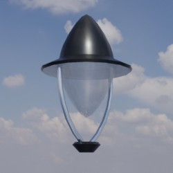
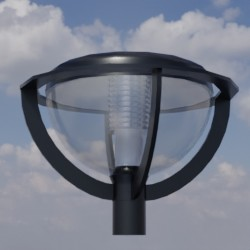
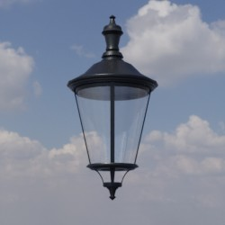

# Lampen
## Allgemein
Dieses Verzeichnis enthält Modelle von Lampenkörpern. Diese entsprechen dem Bauteil ohne Mast oder Ausleger (sofern vorhanden). 
Es werden drei grundsätzliche Typen von Leuchten umgesetzt:
- Aufsatzleuchte
- Ansatzleuchte
- Hängeleuchte

Zugehörige Masten und Ausleger können über den Dateinamen identifiziert werden.

## Grundlage
Als Grundlage für die zur Verfügung gestellten Modelle dienen **Fotos** und **Produktskizzen/-maße** der jeweiligen Realweltobjekte. 
## Modelle 
 | Modellname | Preview | 
 | --- | --- | 
| Albstadt || 
| Urbi_3 || 
| Kleine_Glocke || 
| 5460 || 
| Stradasole_400 || 
| Jana_VI || 
| Viatana || 
| 5450 || 
| 2020 || 
| Agora || 
| DL_30 || 
| Lucas_VII || 
| BG2 || 
| Pilz || 
| Urbi_3_Basket || 
| Floodlight_FL_20 || 
| Park_Crown || 
| DL_50_Mini || 
| DL_20 || 
| Stradasole_530 || 
| City-Light_Plus || 
| Ringleuchte_1400mm || 
| Streetlight_11_Midi || 
| Alte_Stadt || 
| Große_Glocke || 
| 8949 || 
| Semaphor || 
| Laterne || 
| DL_50_Midi || 
| RSL || 
