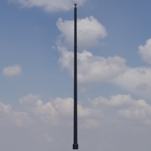
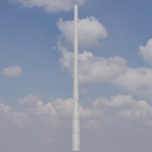
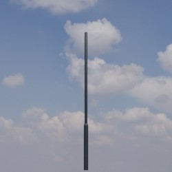
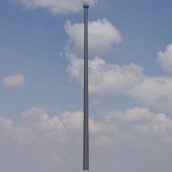
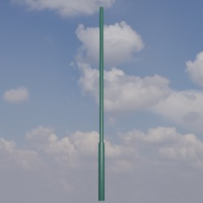
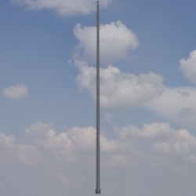
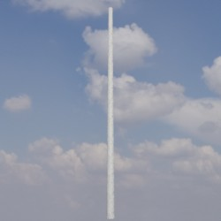
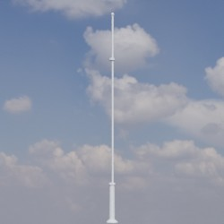

# Masten
Dieses Verzeichnis enthält Modelle von Masten. Die nachgestellte Zahl im Dateinamen entspricht dabei der Höhe des Mastes in Millimeter.

Zugehörige Lampen und Ausleger können über den Dateinamen identifiziert werden.

## Grundlage
Als Grundlage für die zur Verfügung gestellten Modelle dienen **Fotos** und **Produktskizzen/-maße** der jeweiligen Realweltobjekte. 
## Modelle 
 | Modellname | Preview | 
 | --- | --- | 
| grau_4800 || 
| Stahl_11000 || 
| Kleine_Glocke_3000 || 
| Urbi_3_11200 || 
| Stahl_4500 || 
| Stahl_15000 || 
| Stahl_7300 || 
| Stahl_6500 || 
| Stahl_4400 || 
| Stahl_3000 || 
| Urbi_3_6400 || 
| Stahl_5500 || 
| Stahl_3200 || 
| Stahl_4000 || 
| Beton_5000 || 
| Stahl_7500 || 
| Beton_6300 || 
| Stahl_6800 || 
| Beton_6500 || 
| Stahl_9000 || 
| Stahl_3500 || 
| Große_Glocke_6000 || 
| Urbi_3_8000 || 
| Beton_4000 || 
| Stahl_25000 || 
| Stahl_7000 || 
| Histo_5300 || 
| Histo_4300 || 
| Stahl_4300 || 
| Kleine_Glocke_3500 || 
| Stahl_5300 || 
| Urbi_3_10400 || 
| Stahl_10000 || 
| Beton_6000 || 
| Stahl_14000 || 
| Stahl_12000 || 
| Jana_4800 || 
| Albstadt_3500 || 
| Stahl_5000 || 
| Stahl_8000 || 
| Urbi_3_11200_copy || 
| Stahl_8500 || 
| Beton_8000 || 
| Stahl_6000 || 
| Kleine_Glocke_4000 || 
| Semaphor_4500 || 
