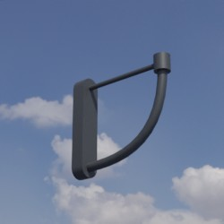

# Wandhalterung
Dieses Verzeichnis enthält Modelle von Wandhalterungen. Die nachgestellten Parameter beschreiben Offsets der zugehörigen Lampe relativ zur Hauptachse des Mastes in Millimeter.

Zugehörige Lampen können über den Dateinamen identifiziert werden.

## Grundlage
Als Grundlage für die zur Verfügung gestellten Modelle dienen **Fotos** und **Produktskizzen/-maße** der jeweiligen Realweltobjekte. 
## Modelle 
 | Modellname | Preview | 
 | --- | --- | 
| Alte_Stadt_x500_y0 || 
| Basket_x564_y0 || 
| Sonderanfertigung_x825_y0 || 
