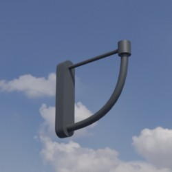
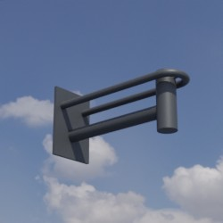

# Wandhalterung
Dieses Verzeichnis enthält Modelle von Wandhalterungen. Die nachgestellten Parameter beschreiben Offsets der zugehörigen Lampe relativ zur Hauptachse des Mastes in Millimeter.

Zugehörige Lampen können über den Dateinamen identifiziert werden.

## Grundlage
Als Grundlage für die zur Verfügung gestellten Modelle dienen **Fotos** und **Produktskizzen/-maße** der jeweiligen Realweltobjekte.

## Modelle 
 | Modellname | Preview | 3D-Modell | 
 | --- | --- | --- |
| Alte_Stadt_x500_y0 || [Link zu Online 3D Viewer](https://3dviewer.net/embed.html#model=https://github.com/rostock/3DModels/blob/main/Beleuchtung_Wandhalterung/glb/Alte_Stadt_x500_y0.glb$camera=0,0,0$cameramode=perspective$envsettings=fishermans_bastion,on$backgroundcolor=200,200,200,255$defaultcolor=200,200,200$edgesettings=off,0,0,0,20) |
| Basket_x564_y0 || [Link zu Online 3D Viewer](https://3dviewer.net/embed.html#model=https://github.com/rostock/3DModels/blob/main/Beleuchtung_Wandhalterung/glb/Basket_x564_y0.glb$camera=0,0,0$cameramode=perspective$envsettings=fishermans_bastion,on$backgroundcolor=200,200,200,255$defaultcolor=200,200,200$edgesettings=off,0,0,0,20) |
